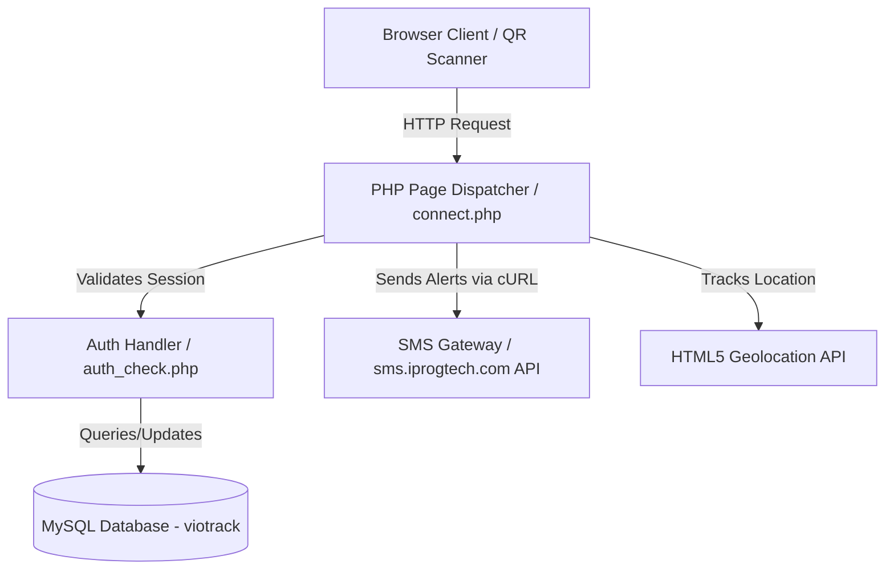
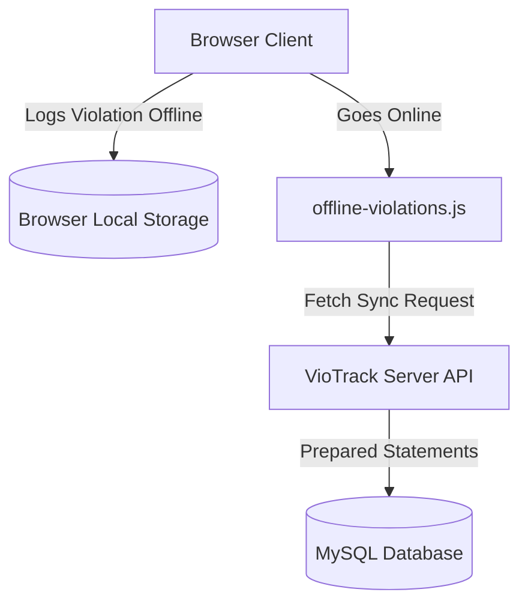

# 🛡️ VIOTRACK Student Violation Tracking and Monitoring System Using QR Code and Dashboard

[](https://www.php.net/)
[](https://www.mysql.com/)
[](https://leafletjs.com/)
[](https://sweetalert2.github.io/)

> A professional, full-featured student infraction tracking and monitoring platform for Perpetual Help College of Manila (PHCM), featuring secure offline QR scanning, real-time GPS hotspot tracking, automated SMS parent notifications, and an interactive administrator dashboard with unified light/dark theme support.

---

## 📋 Table of Contents

- [Overview](#-overview)
- [System Architecture](#%EF%B8%8F-system-architecture)
- [Key Features](#-key-features)
- [Technical Highlights](#-technical-highlights)
- [Tech Stack](#-tech-stack)
- [Project Structure](#-project-structure)
- [Database Schema](#-database-schema)
- [Getting Started](#-getting-started)
  - [Prerequisites](#prerequisites)
  - [Installation](#installation)
  - [Database Setup](#database-setup)
- [Usage & Credentials](#-usage--credentials)
- [Security Features](#-security-features)
- [License](#-license)

---

## 📌 Overview

**VioTrack** is a robust web application tailored for student coordinators, advisers, and school administrators at Perpetual Help College of Manila. Moving beyond outdated paper files, VioTrack allows teachers to scan secure student QR codes to log violations immediately, capture geolocation coordinates to highlight violation "hotspots" on campus, send instant SMS alerts to parents/guardians, and sync records logged offline.

---

## 🏗️ System Architecture

### Online Infraction Routing


### Offline Caching & Sync Flow


---

## ✨ Key Features

### 📋 Administrative Control Center
- **Statistical Analytics Dashboard** — Visualize infraction frequencies, total violations, resolved vs. pending reports, and active student metrics.
- **Interactive Geolocation Map** — Integrated Leaflet.js map representing violation "hotspots" on campus using coordinates recorded on QR scans.
- **Infraction Record Management** — View and moderate violation records, track statuses (Pending, Under Investigation, Resolved), upload proofs, and document resolutions.
- **User/Staff Moderation** — Complete control over administrative and teacher credentials and profile data.
- **Data Export & Reporting** — Generate print-friendly infraction sheets and download full CSV/PDF violation summaries.

### 🏫 Teacher & Adviser Hub
- **Student Tracker** — Quick tracking search by name or LRN (Learner Reference Number).
- **Class/Section Monitoring** — Advisers can view section-specific infraction details and student lists.
- **Incident Logger** — Directly log infractions with geolocation tracking.

### 📱 Scanner & QR Portal
- **QR Infraction Dispatcher** — Scan a student's QR ID code to instantly display their violation history and open the infraction logger.
- **HTML5 GPS Tracking** — Automatically capture precise GPS coordinates of the logged incident from the reporter's device.
- **Offline Mode Capabilities** — Collect violation data offline (cached in browser Storage) and automatically sync with the server once an internet connection is detected.

### ✉️ Guardian SMS System
- **Real-Time API Notifications** — Directly dispatch text alerts to guardians' registered mobile numbers via the `sms.iprogtech.com` SMS Gateway when an infraction is logged or a meeting is scheduled.
- **Delivery Log System** — Monitor SMS delivery status codes in the Admin Activity Stream.

---

## 🛡️ Technical Highlights

### 1. Dynamic Theme Engine (Dark/Light Mode)
- Implemented using custom CSS variables (`--body-bg`, `--surface`, etc.) mapped across a modern design system.
- Saves preferences to the browser's `localStorage` to prevent style flashes on page load.
- Seamlessly transition from a high-contrast dark theme to a clean light mode with a single header toggle click.

### 2. Offline Data Sync Protocol
- The system leverages `js/offline-violations.js` to store records locally when offline.
- Detects connection status and sends cached records to the backend `php/sync-violations.php` for batch insertion, complete with synchronization status reports.

### 3. Campus Hotspot Visualization
- Utilizes **Leaflet.js** on the administrator dashboard to parse GPS coordinates (latitude/longitude) stored on QR infraction logs.
- Employs skeleton screens for smooth loading transitions while loading geolocation data.

### 4. SweetAlert2 Notifications
- High-fidelity visual toasts (success, error, warning) replace native alert loops.
- Custom asynchronous confirm dialogs for high-risk deletions (`await confirmAction(...)`).

---

## 🛠 Tech Stack

- **Backend**: PHP 8.2+ (with cURL & OpenSSL enabled)
- **Database**: MySQL / MariaDB 10.4+
- **Frontend**: HTML5, CSS3, ES6 JavaScript, Google Fonts (Plus Jakarta Sans, Inter), Font Awesome 6.5
- **Libraries**: Leaflet.js (Map Visualization), SweetAlert2 (Toasts & Modal Dialogs)
- **External Integrations**: iprogtech SMS API (`sms.iprogtech.com`)

---

## 📁 Project Structure

```text
viotrack/
├── css/                    # Custom CSS stylesheets (global variables, responsive layouts)
│   ├── global.css          # Core design system colors, dark theme variables
│   ├── header.css          # Main header styling with theme toggle support
│   └── dashboard.css       # Layout cards, map container, and skeleton loading screen
├── js/                     # Client-side JavaScript logic
│   ├── viotrack-ui.js      # SweetAlert2 toast functions (success, warning, error, confirmAction)
│   ├── offline-violations.js # Local storage caching and background sync handlers
│   └── dashboard.js        # Leaflet map setup and Chart.js analytics logic
├── php/                    # Backend API handlers and modular dashboard components
│   ├── modals/             # Dynamic modal views (add record, edit student, filter records)
│   ├── get_location.php    # API returning violation coordinates for hotspot mapping
│   ├── sync-violations.php # Sync API parsing offline cached violations
│   └── send-sms.php        # API dispatcher to the iprogtech SMS gateway
├── images/                 # Theme graphics and school brand logo assets
├── database/               # SQL database backup scripts or schemas
├── scan-qr.php             # QR scanner portal for security/teachers
├── dashboard.php           # Unified metrics, charts, and Leaflet.js hotspot map
├── connect.php             # Database credentials configuration and query helpers
├── auth_check.php          # Session checker and session validation utilities
└── login.php               # Secure role-based credentials portal
```

---

## 🗄 Database Schema

| Table | Description | Primary Fields |
|---|---|---|
| `student` | Student profile records (LRN, name, grade, section, guardian information, contact, email, image) | `id`, `lrn`, `fname`, `mname`, `lname`, `gender`, `academicyear`, `grade`, `section`, `guardian`, `guardiancontact`, `email`, `password`, `image` |
| `admin` | Administrator profiles and roles | `id`, `fname`, `mname`, `lname`, `email`, `password`, `role`, `image` |
| `teacher` | Teacher credentials and position assignments | `id`, `fname`, `mname`, `lname`, `email`, `password`, `position`, `image` |
| `violation` | Predefined school policy violations and categories | `id`, `title`, `description`, `type` |
| `record` | Active violation event logs including location coordinates and status | `id`, `sid`, `vid`, `aid`, `date`, `lat`, `lng`, `accuracy`, `status`, `proof`, `type` |
| `adviser` | Classroom adviser assignments link to teachers | `id`, `tid`, `fname`, `mname`, `lname`, `email`, `grade_level`, `class_section`, `image` |
| `report` | Parent meeting schedules and SMS logs | `id`, `sid`, `type`, `date`, `comment`, `status` |
| `activity` | Audit log of actions taken by administrators and teachers | `id`, `aid`, `description`, `date` |
| `qr_tokens` | Session security tokens for scanning URL validation | `id`, `student_id`, `token`, `created_at` |

---

## 🚀 Getting Started

### Prerequisites
- **XAMPP / WampServer** (or any server stack running PHP 8.2+ and MySQL/MariaDB 10.4+)
- **Active Internet Connection** (for map rendering via Leaflet.js CDNs, SweetAlert2 libraries, Google Fonts, and the SMS API)

### Installation
1. Extract or clone this repository to your Apache server folder (e.g. `htdocs/viotrack`):
   ```bash
   C:\xampp\htdocs\viotrack\
   ```
2. Start Apache and MySQL via the **XAMPP Control Panel**.

### Database Setup
1. Open phpMyAdmin at `http://localhost/phpmyadmin`.
2. Create a new database named **`viotrack`**.
3. Import your database schema dump (`viotrack.sql`) to load the pre-configured tables.
4. Verify database configurations in `connect.php`:
   ```php
   define('DB_SERVER', 'localhost');
   define('DB_USERNAME', 'root');
   define('DB_PASSWORD', '');
   define('DB_NAME', 'viotrack');
   ```

---

## 🖥️ Usage & Credentials

### Access Links
* **Homepage/Dashboard**: `http://localhost/viotrack/`
* **Login Portal**: `http://localhost/viotrack/login.php`

### Sample Roles
* **Administrator** — Full administrative control including user management, infraction history, sync audits, and map views.
* **Teacher** — Log student infractions, check student details, and monitor classroom section records.

---

## 🔒 Security Features
- **Prepared Statements** — Prevents SQL Injection (SQLi) attacks by parameterizing database queries.
- **CSRF Token Validation** — Form validations checking state tokens.
- **Secure Session Limits** — Session validation and automatic timeout configuration based on user roles (1 hour for admins, 30 minutes for teachers).
- **Directory Access Control** — Native validation and folder restrictions preventing unauthenticated navigation.

---

## 📄 License

This repository is built for educational and academic purposes. All rights reserved.

<div align="center">
  <sub>VioTrack &copy; 2026</sub>
</div>
